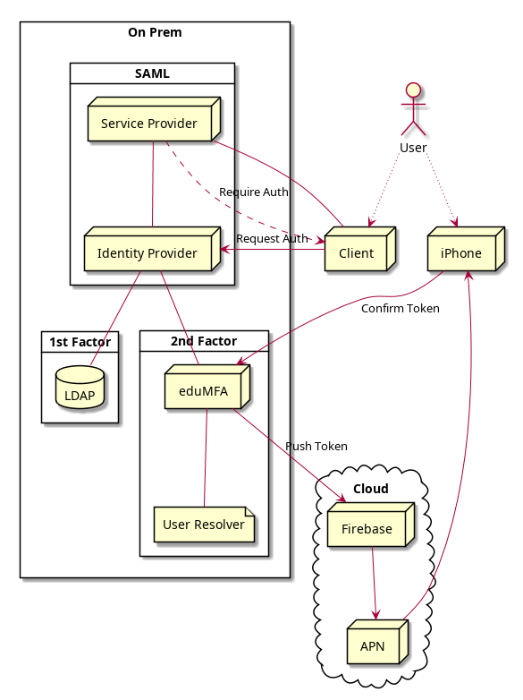

.. _edupush_token:

eduPUSH Token
----------

.. index:: eduPush Token, Firebase service

The eduPUSH token uses the *eduMFA Authenticator* app. You can get it
from `Google Play Store`_ or `Apple App Store`_.

.. _Google Play Store: https://play.google.com/store/apps/details?id=io.edumfa.authenticator
.. _Apple App Store: https://apps.apple.com/app/edumfa-authenticator/id6479982721

The token type *edupush* sends a cryptographic challenge via the
Google Firebase service to the smartphone of the user. This push
notification is displayed on the smartphone of the user with a text
that tells the user that he or somebody else requests to login to a
service. The user can simply accept this request.
The smartphone sends a cryptographically signed response to the
eduMFA server and the login request gets marked as confirmed
in the eduMFA server. The application checks for this mark and
logs the user in automatically. For an example of how the components in a
typical deployment of eduPUSH tokens interact reference the following diagram.

  *A typical eduPUSH token deployment*

To allow eduMFA to send push notifications, a Firebase service
needs to be configured. To do so see :ref:`firebase_provider`.

The eduPUSH token implements the :ref:`outofband mode <authentication_mode_outofband>`.

Configuration
~~~~~~~~~~~~~

The minimum necessary configuration is an ``enrollment`` policy
:ref:`policy_firebase_config`.

With the ``authentication`` policies :ref:`policy_push_text_on_mobile`
and :ref:`policy_push_title_on_mobile` you can define
the contents of the push notification.

If you want to use eduPUSH tokens with legacy applications that are not yet set up to be compatible with out-of-band
tokens, you can set the ``authentication`` policy :ref:`policy_push_wait`. Please note, that setting this policy can
interfere with other token types and will impact performance, as detailed in the documentation for ``edupush_wait``.

Enrollment
~~~~~~~~~~

The enrollment of the eduPUSH token happens in two steps.

Step 1
......

The user scans a QR code. This QR code contains the
basic information for the eduPUSH token and a enrollment URL, to which
the smartphone should respond in the enrollment process.

The smartphone stores this data and creates a new key pair.

Step 2
......

The smartphone sends its Firebase ID, the public key of the keypair,
the serial number and an enrollment credential back to the
enrollment URL of the eduMFA server.

The server responds with it's public key for this token.

Authentication
~~~~~~~~~~~~~~

Triggering the challenge
........................

The authentication request is triggered by an application
just the same like for any
challenge response tokens either with the PIN to the
endpoint ``/validate/check`` or via the endpoint
``/validate/triggerchallenge``.

eduMFA sends a cryptographic challenge with a signature to
the Firebase service.
The firebase service sends the notification to the smartphone,
which can verify the signature using the public key from enrollment step 2.

Accepting login
...............

The user can now accept the login by tapping on the push notification.
The smartphone sends the signed challenge back to the authentication URL
of the eduMFA server.
The eduMFA server verifies the response and marks this authentication
request as successfully answered.

In some cases the push notification does not reach the smartphone.
The smartphone can also poll for active challenges.

Login to application
....................

The application can check with the original transaction ID
with the eduMFA server, if the challenge has been successfully
answered and automatically login the user.

