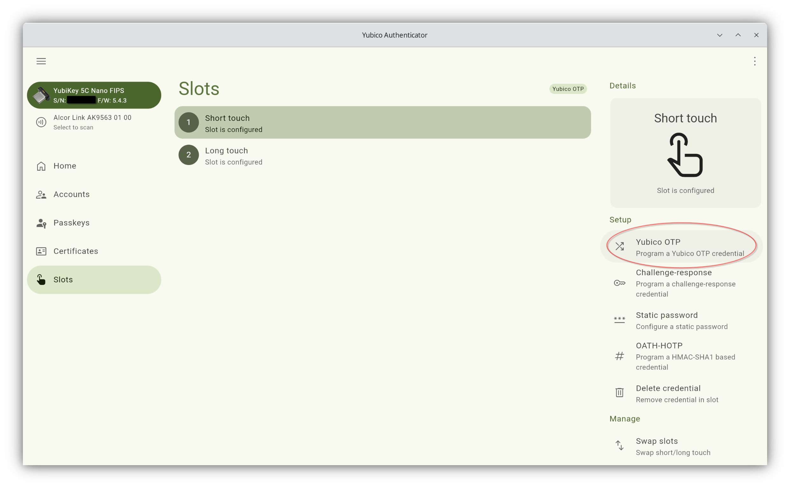
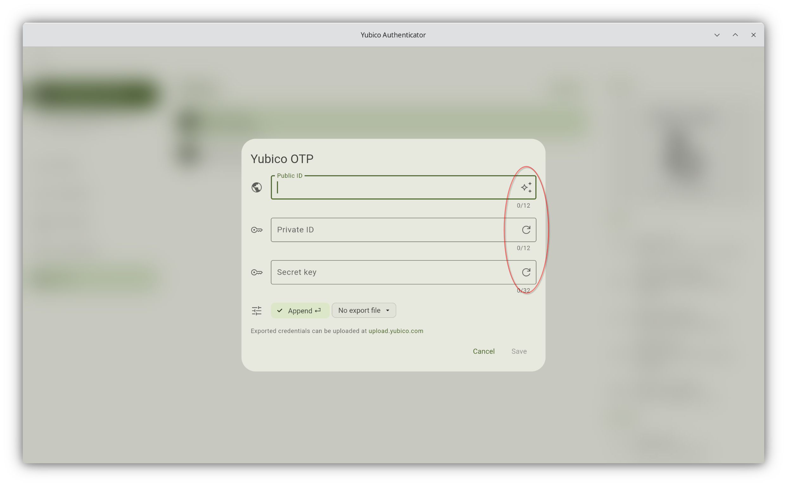

.. _yubikey_enrollment_tools:

Yubikey Enrollment Tools
------------------------

.. index:: Yubikey, Yubico AES mode, Yubikey OATH-HOTP mode

The Yubikey can be used with eduMFA in Yubico's own AES mode ("Yubico OTP") or
the seldom used static password mode. It also supports importing an existing
HOTP secret ("OATH-HOTP").

This section describes tools which can be used to initialize and enroll a
Yubikey with eduMFA.

If not using the :ref:`yubico_token` mode, the Yubikey has to be
initialized/configured which creates a new secret on the device that has to be
imported to eduMFA.

.. _ykapp:

Yubikey Authenticator
~~~~~~~~~~~~~~~~~~~~~

.. index:: Yubikey, Yubikey Authenticator

You can initialize the Yubikey with the official Yubico Authenticator
application [#ykappurl]_ and use the obtained secret to enroll the Yubikey with
eduMFA.

Manual token enrollment
.......................

To initialize a single Yubikey in AES mode (Yubico OTP) open the "Slots" menu,
select a slot and press "Yubico OTP". To generate the values, press the
right-hand button in each field. Copy the displayed secret labeled with "Secret
Key" to the field *OTP Key* on the enrollment form in the eduMFA WebUI.

   *Create a new Yubikey OTP token in a key slot*

   *Select all the buttons to generate values*

.. figure:: images/enroll_yubikey.png
   :width: 500

   *Enroll a Yubikey AES mode token in eduMFA*

In the field "Test Yubikey" touch the Yubikey button. This will determine the
length of the *OTP value* and the field *OTP length* is automatically filled.

.. note::
    The length of the unique passcode for each OTP is 32 characters at the end
    of the OTP value. The remaining characters at the beginning of the OTP value
    form the Public ID of the device. They remain constant for each
    OTP [#ykotp]_.

    eduMFA takes care of separating these parts but it needs to know the
    complete length of the OTP value to work correctly.

.. rubric:: Footnotes

.. [#ykappurl] https://www.yubico.com/products/yubico-authenticator/
.. [#ykotp] https://developers.yubico.com/OTP/OTPs_Explained.html
